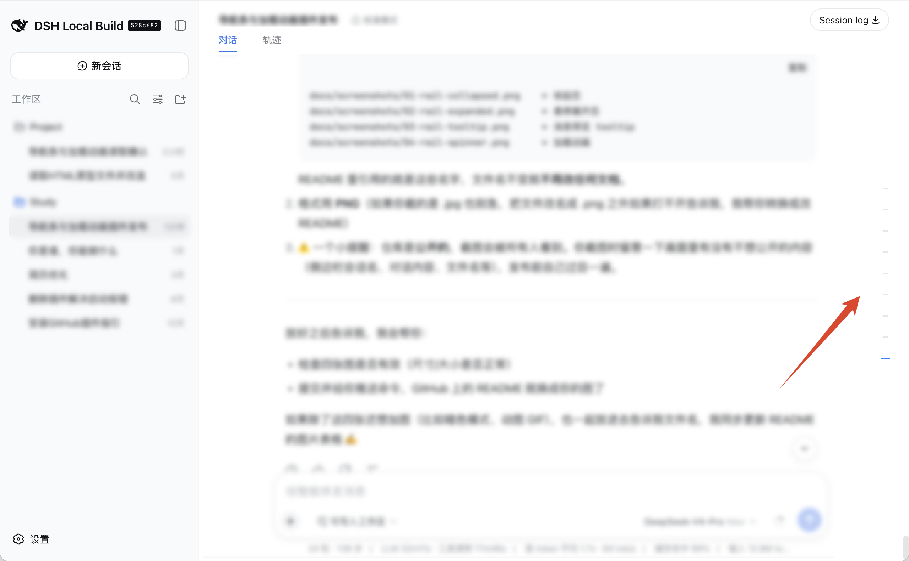
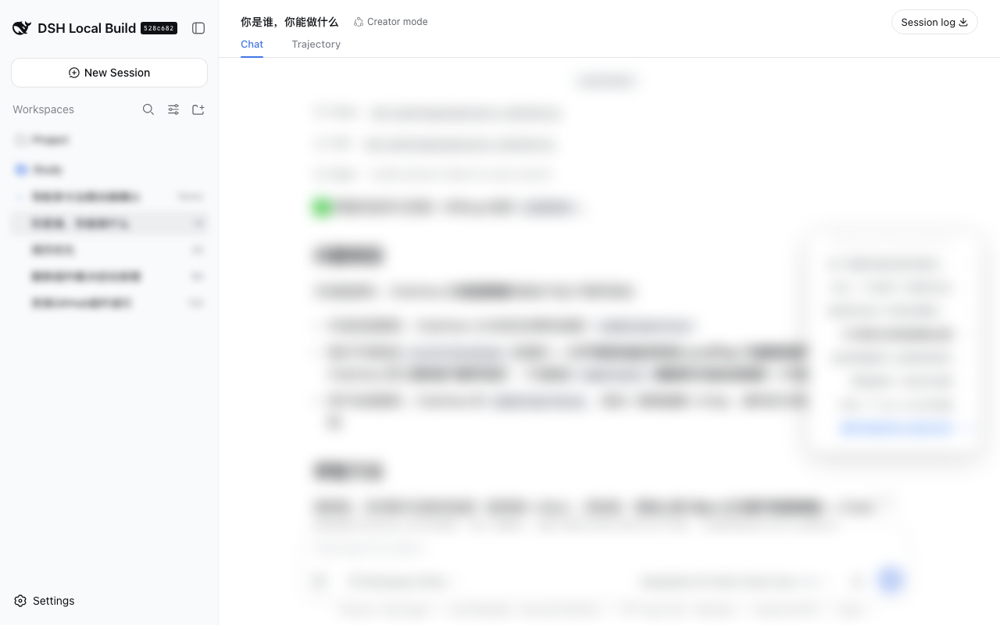
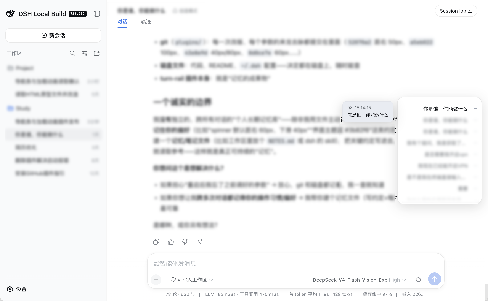
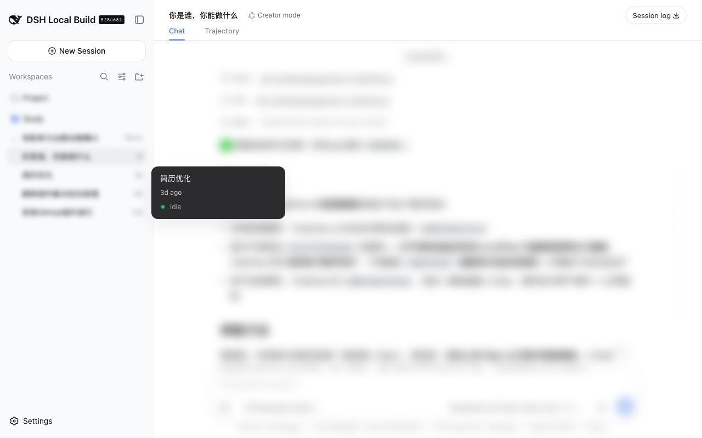

# turn-rail — DeepSeek Harness Web 对话轮次导航条

> 给 [DeepSeek Harness](https://github.com/deepseek-ai/deepseek-harness) 的 Web 界面（`dsh web`）加一条悬浮在窗口右侧的**对话轮次导航条**：一眼看清会话里的全部轮次，悬停预览内容，点击直接跳转。跳转到尚未加载的早期轮次时自动翻页，并显示一个 iOS 风格的**加载动画**。

## 功能

### 导航条

- 34×300px 玻璃长条固定在窗口右侧居中，收起时几乎不遮挡内容
- 每行代表一条用户消息：8×2px 指示线 + 消息标题
- **悬停长条** → 展开成面板（最宽 240px），显示全部轮次标题，顶/底渐隐提示可滚动
- **悬停某一行** → tooltip 预览该条消息（时间 + 最多 5 行截断）
- **点击一行** → 平滑滚动定位到该轮次，目标消息闪烁高亮
- **滚动跟随**：当前阅读位置对应的轮次自动高亮（品牌蓝、指示线加长），导航条跟随滚动居中；手动滚动导航条可自由浏览全部轮次（暂停跟随 3 秒）
- 全量历史来自服务端投影（`turn-rail-history`），长会话也只传输几 KB 的轮次摘要，不加载整个对话

### 加载动画

- 点击尚未加载进窗口的早期轮次时，自动逐页点击"加载更早"翻找目标，同时在对话窗口右侧显示 42px 苹果风 spinner（12 根放射条、逐条相位旋转）
- 动画从窗口顶部上方滑入，加载完成滑回顶部淡出，不侵入标题栏

## 截图

> 演示截图中的会话内容已做模糊处理，轮次标题为示例文案。

| 收起态 | 悬停展开 |
| --- | --- |
|  |  |

| 消息预览 tooltip | 点击早期轮次时的加载动画 |
| --- | --- |
|  |  |

## 安装

### 要求

- dsh ≥ 0.1.1-rc.8（需要 `sessionProjections` 投影注册接口与 `wire.view` 协议）
- 已生成 web profile：至少运行过一次 `dsh web`
- Node.js（安装脚本编辑 JSON 用）

### 一键安装

```bash
git clone https://github.com/<你的账号>/turn-rail.git
cd turn-rail
./install.sh
```

重启 `dsh web` 服务后生效（桌面端退出重开即可）。

### 手动安装（`install.sh` 做的事）

1. 复制两个包到 profile 的 node_modules：

   ```bash
   cp -R turn-rail        ~/.dsh/profiles/node_modules/@dsh-user/turn-rail
   cp -R turn-rail-bundle ~/.dsh/profiles/node_modules/@dsh-user/turn-rail-bundle
   ```

2. 在 `~/.dsh/profiles/web/package.json` 的 `dsh.profile.bundles` 里追加 `@dsh-user/turn-rail-bundle`
3. 重启服务

### 卸载

```bash
./uninstall.sh
```

## 使用

- 窗口右侧的细条即导航条：悬停展开、悬停单行看预览、点击跳转
- 点击早期未加载的轮次：出现加载动画并自动翻页，到达后目标消息闪烁定位
- 手动滚动导航条浏览全部轮次，停止滚动 3 秒后恢复跟随当前阅读位置

## 工作原理

| 包 | 作用 |
| --- | --- |
| `turn-rail/` | 插件本体。服务端 `index.js` 注册 `turn-rail-history` 投影，把全量会话折叠成 `[{seq, time, text}]` 轮次摘要；客户端 `client.js` 是手写的浏览器 bundle（`window.__ModuleLoader__.load` 契约，免构建），注入 conversation 槽位渲染导航条与 spinner |
| `turn-rail-bundle/` | profile bundle：`cordis.patch.yml` 把插件行插入 web roster，随服务自动加载 |

## 目录结构

```
.
├── README.md
├── CHANGELOG.md
├── LICENSE
├── install.sh            # 一键安装
├── uninstall.sh          # 卸载
├── turn-rail/            # 插件本体
│   ├── client.js         # 浏览器端：导航条 + 加载动画
│   ├── index.js          # 服务端：turn-rail-history 投影
│   └── package.json
├── turn-rail-bundle/     # profile bundle（安装器）
│   ├── cordis.patch.yml
│   ├── index.js
│   └── package.json
└── docs/screenshots/     # 效果截图
```

## FAQ

**改了 `client.js` 之后要做什么？**
覆盖 `~/.dsh/profiles/node_modules/@dsh-user/turn-rail/client.js` 后重启服务即可（bundle 的 rev 是内容哈希，浏览器会自动刷新缓存）。

**为什么看不到导航条？**
会话里还没有用户消息时不渲染。另外确认 web profile 里已注册 `@dsh-user/turn-rail-bundle`（`install.sh` 会做这件事）。

**服务重启后插件会丢吗？**
不会。插件通过 profile bundle 固化，随 `dsh web` 启动自动加载，不依赖任何会话。

**能改样式吗？**
可以。样式都在 `client.js` 顶部的 CSS 字符串里（`.tr-*` 类），改完按上面方式覆盖安装。

## License

[MIT](LICENSE)
